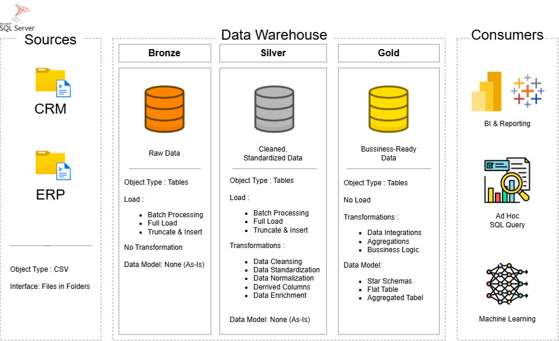

# 🏢 Modern Data Warehouse & Analytics Project

> An end-to-end data warehousing solution built on Microsoft SQL Server — consolidating CRM and ERP source data through a **Medallion Architecture (Bronze, Silver, Gold)** into business-ready models for reporting, ad hoc analysis, and machine learning.


---

## 📖 Project Overview

This project designs and builds a **modern data warehouse** from the ground up, using T-SQL on Microsoft SQL Server. Raw sales data from two independent source systems — a CRM and an ERP — is ingested, cleaned, integrated, and modeled into a single, analytics-ready warehouse using the **Medallion Architecture** pattern: **Bronze** (raw), **Silver** (cleaned & standardized), and **Gold** (business-ready).

**Tech Stack:** Microsoft SQL Server · T-SQL · SQL Server Management Studio (SSMS) · Draw.io

**Objective:** Consolidate CRM and ERP sales data into a single, user-friendly data model that supports analytical reporting on customer behavior, product performance, and sales trends — without requiring historical data tracking, since the project scope focuses on the latest snapshot of data.

---

## 🏗️ Data Architecture



The warehouse follows the **Medallion Architecture**, moving data through three progressively refined layers:

| Layer | Purpose | Object Type | Load Strategy | Transformations | Data Model |
|---|---|---|---|---|---|
| 🟫 **Bronze** | Raw data, stored as-is from source systems | Tables | Batch Processing, Full Load (Truncate & Insert) | None | None (As-Is) |
| ⬜ **Silver** | Cleaned & standardized data | Tables | Batch Processing, Full Load (Truncate & Insert) | Data Cleansing, Standardization, Normalization, Derived Columns, Enrichment | None (As-Is) |
| 🟨 **Gold** | Business-ready data, modeled for consumption | Tables / Views | No Load | Data Integration, Aggregations, Business Logic | Star Schema, Flat Table, Aggregated Table |

**Sources:** CRM and ERP systems, both delivered as CSV files (Interface: Files in Folders).

**Consumers:** The Gold layer is designed to serve three types of downstream consumption — **BI & Reporting** dashboards, **Ad Hoc SQL Queries** for analysts, and **Machine Learning** pipelines that need clean, business-ready features.

---

## 📂 Repository Structure

```text
data-warehouse-project/
│
├── datasets/                       # Raw source data used for the project (CRM and ERP CSV files)
│   ├── source_crm/                 # Data exported from the CRM system
│   │   ├── cust_info.csv           # Customer master data
│   │   ├── prd_info.csv            # Product master data
│   │   └── sales_details.csv       # Sales transaction records
│   └── source_erp/                 # Data exported from the ERP system
│       ├── CUST_AZ12.csv           # Supplementary customer data (birthdate, gender)
│       ├── LOC_A101.csv            # Customer location/country data
│       └── PX_CAT_G1V2.csv         # Product category and maintenance data
│
├── docs/                           # Project documentation and architecture details
│   ├── Data_Architecture.png       # Diagram of the Bronze-Silver-Gold layered architecture
│   ├── Data_Flow.png               # Diagram showing how data flows between layers
│   ├── Data_Integration.png        # Diagram showing how CRM and ERP sources are integrated
│   ├── Data_Model.png              # Diagram of the Gold layer's star schema
│   ├── ETL.jpeg                    # Diagram of the ETL techniques and methods used
│   ├── data_catalog.md             # Catalog of datasets, including field descriptions and metadata
│   └── naming_conventions.md       # Consistent naming guidelines for tables, columns, and files
│
├── scripts/                        # T-SQL scripts, organized by Medallion layer
│   ├── init_database.sql           # Creates the warehouse database and schemas
│   ├── bronze/                     # Scripts for extracting and loading raw data
│   │   ├── ddl_bronze.sql          # Table definitions for the Bronze layer
│   │   └── proc_load_bronze.sql    # Stored procedure to load raw CSVs into Bronze tables
│   ├── silver/                     # Scripts for cleaning and transforming data
│   │   ├── ddl_silver.sql          # Table definitions for the Silver layer
│   │   └── proc_load_silver.sql    # Stored procedure to clean, standardize, and load Silver tables
│   └── gold/                       # Scripts for creating business-ready analytical models
│       └── ddl_gold.sql            # View definitions implementing the Gold layer's star schema
│
├── tests/                          # Data quality validation scripts
│   ├── quality_check_silver.sql    # Validates data quality at the Silver layer
│   └── quality_check_gold.sql      # Validates data quality and referential integrity at the Gold layer
│
├── LICENSE.txt                     # License information for the repository (MIT)
└── README.md                       # Project overview and instructions
```

---

## 🚀 Getting Started

1. **Set up the database** — run `scripts/init_database.sql` to create the warehouse database and its schemas.
2. **Build the Bronze layer** — run `scripts/bronze/ddl_bronze.sql` to create the raw tables, then `scripts/bronze/proc_load_bronze.sql` to load the CSVs from `datasets/`.
3. **Build the Silver layer** — run `scripts/silver/ddl_silver.sql`, then `scripts/silver/proc_load_silver.sql` to clean, standardize, and load the data.
4. **Build the Gold layer** — run `scripts/gold/ddl_gold.sql` to create the final business-ready views (star schema).
5. **Validate the results** — run the scripts in `tests/` to check data quality at both the Silver and Gold layers.

---

## 🙏 Acknowledgments & Credits

This project was built as a hands-on learning experience, following and adapting the excellent tutorial by **Baraa Khatib Salkini (Data With Baraa)**. His course provided the foundational architecture and teaching structure for building a data warehouse from scratch with SQL Server.

Building on that foundation, I adapted and customized the T-SQL scripts for my own SQL Server environment — including handling specific data quality issues found in the source data, adjusting transformation logic, and standardizing column naming to uppercase conventions.

- 📺 Original Tutorial: [Data With Baraa — SQL Data Warehouse Project](https://youtu.be/9GVqKuTVANE)
- 📦 Original Repository: [DataWithBaraa/sql-data-warehouse-project](https://github.com/DataWithBaraa/sql-data-warehouse-project)

---

## 👤 About Me

**Roihan Saputra**
Undergraduate student pursuing a Diploma IV in **Computer Engineering Technology (Teknologi Rekayasa Komputer)** at **Politeknik Negeri Semarang**.

Interested in backend development, data engineering, and building robust IT architectures — this project is part of that ongoing practice.

GitHub: [https://github.com/RoihansLab](https://github.com/RoihansLab)

---

## 🛡️ License

This project is licensed under the **MIT License** — see [`LICENSE.txt`](LICENSE.txt) for details. You are free to use, modify, and share this project with proper attribution.
